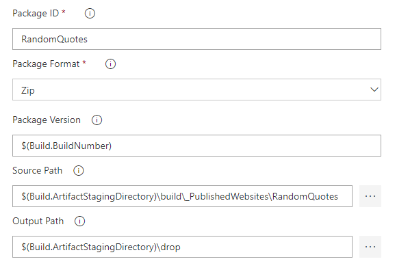
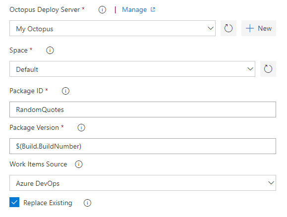
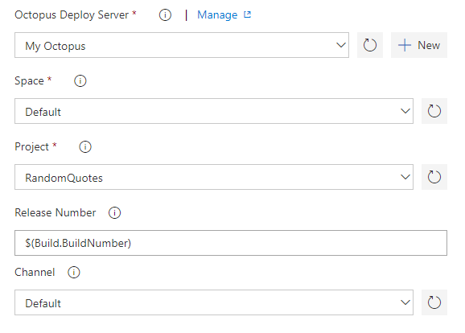
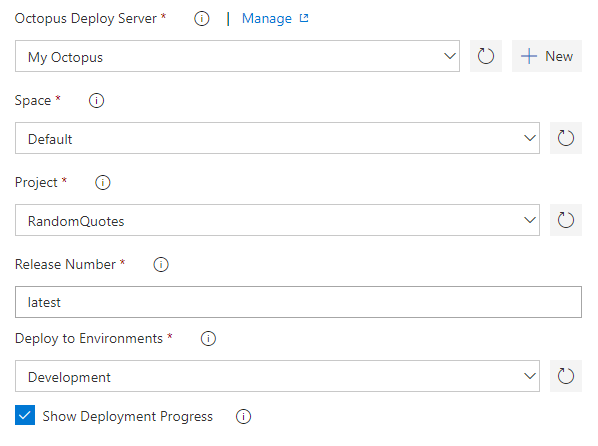

This extension provides Build and Release tasks to integrate with [Octopus Deploy](http://octopus.com), as well as a dashboard widget to show the status of a deployment in Octopus.

[Octopus Deploy](https://octopus.com) is great for deploying ASP.NET or .NET Core applications running on IIS or Azure, Windows services, SQL databases, and much, much more.

Note: This extension is only compatible with Azure DevOps, Team Foundation Server (TFS) 2017 Update 1 and above, and Visual Studio Team Services (VSTS).  There is an alternative extension compatible with TFS 2015 Update 2 and above. See <a href="https://g.octopushq.com/TFS-VSTS-compat">the Octopus Documentation</a> for extension compatibility details and a download link.

## Requirements

You will need a minimum build agent version of `2.115.0` with .NET Core SDK `2.0` or later. When targeting build agents without the SDK, you can use the **.NET Core SDK Installer** task to install it. Generally the Hosted Linux, Mac and Hosted VS2017 agent queues already provide it, however please refer to Microsoft documentation regarding what capabilities are provided by which hosted agent pools.

## Add Octo.exe Command Line tools

The Octopus tasks require the Octo.exe Command Line tools, which can be supplied any of the following ways:

* Insert the **Octopus tools installer** task into the build pipeline. If you leave the version as `embedded`, a built-in copy of the tools will be supplied to the other tasks. If you set the version to `latest` or a specific number, that version will be downloaded and supplied to the other tasks. If the download fails, the built-in copy of the tools will be used.
* Update the system `PATH` environment variable to include a folder containing `Octo.exe` or `Octo.cmd`, on all systems running VSTS agents. You will need to restart the `VSTS Agent` service (or the whole system) for the change to take effect.
* If the Octo.exe Command Line tools are not supplied, the Octopus tasks will attempt to download the latest version themselves. **Note**: For technical reasons they cannot access the built-in copy of the tools unless the **Octopus tools installer** task already ran.

## Add a service connection to Octopus Deploy

Before adding any Build or Release tasks to your process, configure an "Octopus Deploy" service connection in the **Project Settings** under **Service connections**.

You'll need an API Key for a user that has sufficient permissions for the tasks you want to perform in your build and release process.
For example, if your build needs to create a Release for Project A, the user who owns that API key will need ReleaseCreate role either unscoped or scoped to Project A.

## Tasks and Widgets

This extension adds the following tasks:

- Octopus tools installer
- Package Application for Octopus
- Push Packages to Octopus
- Push Package Metadata to Octopus
- Create Octopus Release
- Deploy Octopus Release
- Promote Octopus Release

And the following widget:

- Octopus Deploy Status

##  Octopus tools installer

Optional. Use this task to supply the Octo.exe Command Line tools to other tasks, by downloading them or using a built-in copy.

Alternatively, you can supply the tools using the system `PATH` environment variable, or allow the other tasks to download the latest version themselves. For more information, see [Add Octo.exe Command Line tools](#add-octoexe-command-line-tools) above.

 Options include:

 * **Octopus Tool Version**: If you leave the version as `embedded`, a built-in copy of the tools will be supplied to the other tasks. If you set the version to `latest` or a specific number, that version will be downloaded and supplied to the other tasks. If the download fails, the built-in copy of the tools will be used.

##  Package Application for Octopus

*Note: You can still use [OctoPack](http://docs.octopusdeploy.com/display/OD/Using+OctoPack) as part of your MSBuild task to package and push Nuget packages to Octopus when targeting full .NET framework projects.*

Options include:

 * **Package ID**: The ID of the package. e.g. MyCompany.App
 * **Package Format**: NuPkg or Zip.
 * **Package Version**: The version of the package; must be a valid [SemVer](http://semver.org/) version; defaults to a timestamp-based version.
 * **Source Path**: The folder containing the files and folders to package. Defaults to working directory.
 * **Output Path**: The directory into which the generated package will be written. Defaults to working directory.
 * **NuGet** section: Additional details for the NuGet Package Metadata.
 * **Advanced Options** section: Additional files to include in the package, whether to overwrite any existing file of the same name, and other options.

##  Push Packages to Octopus

 

 Options include:

 * **Octopus Deploy Server**: The Octopus Server (click **New** to [add a service connection](#Add-a-service-connection-to-Octopus-Deploy)).
 * **Space**: The Octopus space to push a package to.
 * **Package**: Package file to push. To push multiple packages, enter multiple lines.
 * **Replace Existing**: If the package already exists in the repository, the default behavior is to reject the new package being pushed. Set this flag to **True** to overwrite the existing package.
 * **Additional Arguments**: Any additional [Octo.exe arguments](http://docs.octopusdeploy.com/display/OD/Pushing+packages) to include.

##  Push Package Metadata to Octopus

 

 Options include:

 * **Octopus Deploy Server**: The Octopus Server (click **New** to [add a service connection](#Add-a-service-connection-to-Octopus-Deploy)).
 * **Space**: The Octopus space to push package metadata to.
 * **Package ID**: The ID of the package, pushed previously, to push metadata onto. e.g. MyCompany.App
 * **Package Version**: The version of the package, pushed previously, to push metadata onto.
 * **Work Items Source**: The service hosting any work items associated with each version of the package. Octopus will add information about the work items to the package metadata, which can be used in release notes.
 * **Replace Existing**: If the package metadata already exists in the repository, the default behavior is to reject the new metadata being pushed. Set this flag to 'True' to overwrite the existing package metadata.
 * **Additional Arguments**: Any additional [Octo.exe arguments](https://octopus.com/docs/octopus-rest-api/octo.exe-command-line/push-metadata) to include.

##  Create Octopus Release

 

 Options include:

 * **Octopus Deploy Server**: The Octopus Server (click **New** to [add a service connection](#Add-a-service-connection-to-Octopus-Deploy)).
 * **Space**: The Octopus space to create a release in.
 * **Project**: The Octopus project to create a release for.
 * **Release Number**: Release number for the new release (leave blank to let Octopus decide).
 * **Channel**: Channel to use for the new release.
 * **Include Changeset Comments**:  Whether to include changeset/commit comments in the Octopus release notes.
 * **Include Work Items**:  Whether to include linked work item titles in the Octopus release notes.
 * **Custom Notes**: Any additional static release notes to be included in the Octopus release.
 * **To Environment**:  Optional environment to deploy to after release creation.
 * **Show Deployment Progress**: Whether to wait for the operation to finish, recording output in the log, and only succeeding if the operation finished successfully.
 * **Tenant(s)**: Comma-separated list of Tenants to deploy to. Note that if completed, this will be treated as a [Tenanted Deployment](http://docs.octopusdeploy.com/display/OD/Multi-tenant+deployments) by Octopus.
 * **Tenant tag(s)**: Comma-separated list of Tenant tags matching Tenants to deploy to. Note that if completed, this will be treated as a [Tenanted Deployment](http://docs.octopusdeploy.com/display/OD/Multi-tenant+deployments) by Octopus.
 * **Additional Octo.exe Arguments**:  Any additional [Octo.exe arguments](http://docs.octopusdeploy.com/display/OD/Creating+releases) to include.

### Regarding Release Notes

The *Release Notes* options, if selected, will result in nicely formatted release notes with deep links to Team Foundation Server or Visual Studio Team Services. Even if no additional options are selected, the related VSTS Build number will be included in the Octopus release notes.

###  Deploy Octopus Release

 

 Options include:

 * **Octopus Deploy Server**: The Octopus Server (click **New** to [add a service connection](#Add-a-service-connection-to-Octopus-Deploy)).
 * **Space**: The Octopus space the release is in.
 * **Project**: The Octopus project to deploy.
 * **Release Number**: Release number for the new release (defaults to `latest`).
 * **Deploy to Environments**: Comma-separated list of environments to deploy to.
 * **Show Deployment Progress**: Whether to wait for the deployment to finish, recording output in the log, and only succeeding if the deployment finished successfully.
 * **Tenant(s)**: Comma-separated list of Tenants to deploy to. Note that if completed, this will be treated as a [Tenanted Deployment](http://docs.octopusdeploy.com/display/OD/Multi-tenant+deployments) by Octopus.
 * **Tenant tag(s)**: Comma-separated list of Tenant tags matching Tenants to deploy to. Note that if completed, this will be treated as a [Tenanted Deployment](http://docs.octopusdeploy.com/display/OD/Multi-tenant+deployments) by Octopus.
 * **Additional Arguments**:  Any additional [Octo.exe arguments](https://octopus.com/docs/octopus-rest-api/octo.exe-command-line/deploy-release) to include.

###  Promote Octopus Release

Options include:
 * **Octopus Deploy Server**: The Octopus Server (click **New** to [add a service connection](#Add-a-service-connection-to-Octopus-Deploy)).
 * **Space**: The Octopus space the release is in.
 * **Project**: The Octopus project to deploy.
 * **Promote From**: The environment to promote a deployment from.
 * **Promote To**: The environment to promote a deployment to.
 * **Show Deployment Progress**: Whether to wait for the deployment to finish, recording output in the log, and only succeeding if the deployment finished successfully.
 * **Tenant(s)**: Comma-separated list of Tenants to deploy to. Note that if completed, this will be treated as a [Tenanted Deployment](http://docs.octopusdeploy.com/display/OD/Multi-tenant+deployments) by Octopus.
 * **Tenant tag(s)**: Comma-separated list of Tenant tags matching Tenants to deploy to. Note that if completed, this will be treated as a [Tenanted Deployment](http://docs.octopusdeploy.com/display/OD/Multi-tenant+deployments) by Octopus.
 * **Additional Arguments**:  Any additional [Octo.exe arguments](https://octopus.com/docs/octopus-rest-api/octo.exe-command-line/promote-release) to include.

###  Octopus Deploy Status Widget

Each instance of this widget displays the status of an Octopus project in one environment.

Configuration settings:
 * **Size**: Either a 1x1 or a 2x1 widget size.
 * **Octopus Connection**: The Octopus Server (available once you [add a service connection](#Add-a-service-connection-to-Octopus-Deploy)).
 * **Space**: The Octopus space the project is in.
 * **Octopus Project**: The Octopus project to display.
 * **Environment**: The Octopus environment to display status in.

Clicking on the widget will open the deployment log for the displayed task in Octopus.

**Note:** The widget will only be populated when a deployment of the specified project to the specified environment has occurred.
